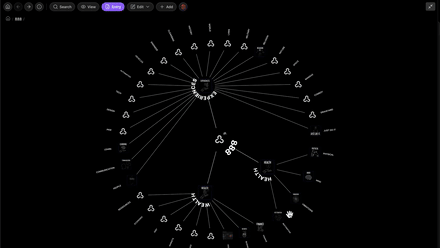

  
  
  <h1 align="center">CONTENT EXPLORER 888</h1>
  <h3 align="center">Standardized Interactive Radial Topic Navigator and Media Feed Engine</h3>

  <!-- TOP PURPLE LINKS -->
  
  
  
   
  <!-- BOTTOM GOLD TAXONOMY -->
  
  
  
  

  

    <i>A two-stage content navigation system combining a multi-ring radial SVG topic map with a platform-optimized vertical media feed player and built-in segment editor.</i>
  

  

Welcome to **Content Explorer 888**, a standardized, production-ready navigation and discovery dashboard for Obsidian vaults. It begins with a dynamic, concentric radial menu that maps your hierarchical note structures. Clicking a final topic leaf seamlessly transitions you to a dedicated vertical content viewer to consume embedded platforms (such as YouTube, Facebook, and Instagram) with custom layouts and viewports.

---

## ✨ Features

### 🌐 Hierarchical Radial Navigation
*   🎡 **Dynamic SVG Concentric Rings**: Renders concentric rings of sub-topics revolving around a central category. 
*   🧭 **Interactive Zoom & Traversal**: Drill down to nested layers on node-click, or navigate back up the tree via home controls or by clicking the central hub.
*   📜 **Auto-Generated Topic Hierarchies**: Generates circular maps dynamically by parsing structural markdown files within the vault.

### 🔄 Dynamic Content Routing & Viewing
*   🚪 **Fluid Workspace Maximizer**: Automatically pushes the active tab contents edge-to-edge, suppressing `.status-bar` and `.view-footer` containers for immersive viewing.
*   🔍 **Standardized Dataview Queries**: Translates selected final nodes to their corresponding `.enigmas` files to load matching feeds.
*   📼 **Guideline-Driven Media Viewports**: Scales embeds dynamically using optimized HSL coordinates for platforms like Instagram, Facebook, TikTok, and YouTube.

### 🛠️ Developer Control Panel
*   💾 **Inline Markdown Segment Editor**: Collapses a developer drawer from the sidebar containing a direct editor to write, modify, and save note chunks on the fly.
*   🔌 **Zero External Dependencies**: Standard modular structure compiled dynamically without requiring heavy node package managers.

---

## 📦 Directory Index & Components

The package exposes the following compiled and standardized files:

| File | Description |
| :--- | :--- |
| **[CONTENT EXPLORER 888.md](CONTENT%20EXPLORER%20888.md)** | Main loader query designed to be opened in any Obsidian workspace tab. |
| **[src/index.jsx](src/index.jsx)** | dynamic bootstrapper loader that compiles modules asynchronously. |
| **[src/App.jsx](src/App.jsx)** | Coordinating main controller coordination React view. |
| **[src/components/ViewComponent.jsx](src/components/ViewComponent.jsx)** | Core vertical media player and iFrame embed panel view. |
| **[src/components/ViewComponentBounty.jsx](src/components/ViewComponentBounty.jsx)** | Main interactive radial map rendering circular SVG navigation layers. |
| **[src/components/FileSectionsProvider.jsx](src/components/FileSectionsProvider.jsx)** | Document parser loading segments and running the inline segment editor. |
| **[src/components/ImagesPlaceholder.jsx](src/components/ImagesPlaceholder.jsx)** | Standardized drawing database generating fallback vector category icons. |
| **[src/utils/UtilityFunctions.jsx](src/utils/UtilityFunctions.jsx)** | Media URL filters and container resize event observers. |
| **[src/utils/IframesGuidelines.js](src/utils/IframesGuidelines.js)** | Aspect-ratio guideline maps for responsive platform iframe embedding. |
| **[METADATA.md](METADATA.md)** | Machine-readable manifest outlining packaging attributes. |
| **[CONTRIBUTION.md](CONTRIBUTION.md)** | Structural layout standards and core modular developer guides. |
| **[LICENSE.md](LICENSE.md)** | Clean MIT License. |
| **[assets/content_explorer.webp](assets/content_explorer.webp)** | Standardized static thumbnail preview image of the component. |
| **[assets/contentexplorer888.clip.gif](assets/contentexplorer888.clip.gif)** | Lanczos-compressed loop walkthrough GIF under 1MB. |
